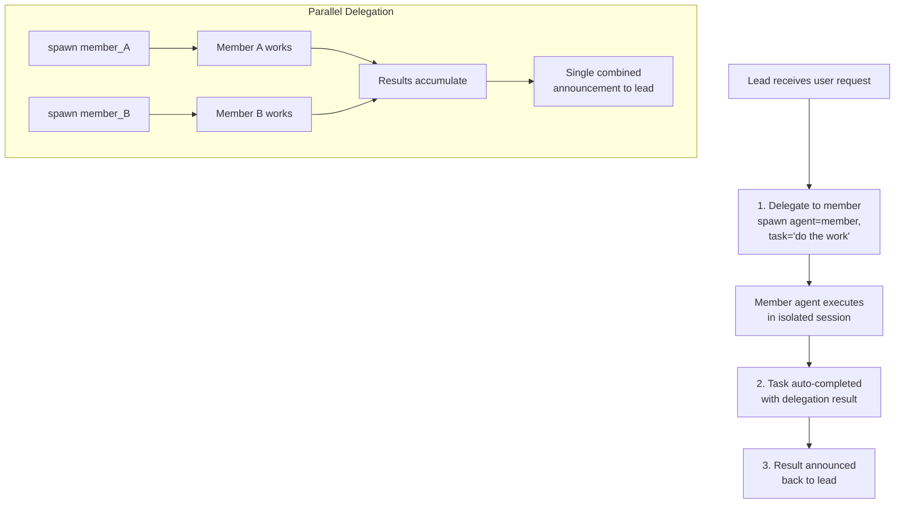

# Delegation & Handoff

Delegation allows the lead to spawn work on member agents. Handoff transfers conversation control between agents without interrupting the user's session.

## Agent Delegation Flow



## Task Linking

Delegations can optionally link to a team task via `team_task_id`. For v2 teams, **if you omit `team_task_id`, the system auto-creates a task** — you don't need a separate create step:

```json
{
  "action": "spawn",
  "agent": "analyst_agent",
  "task": "Analyze the market trends in the Q1 report"
}
```

The system auto-creates a task and links the delegation. You can also provide an explicit task ID:

```json
{
  "action": "spawn",
  "agent": "analyst_agent",
  "task": "Analyze the market trends in the Q1 report",
  "team_task_id": "550e8400-e29b-41d4-a716-446655440000"
}
```

**If `team_task_id` is invalid** or from a wrong team:
- Delegation rejected with helpful error message
- Error includes guidance to omit `team_task_id` to auto-create

**Guards enforced**:
- Cannot reuse a completed or cancelled task ID
- Cannot reuse an in-progress task ID (each spawn needs its own task)

This ensures every piece of work is tracked on the task board.

## Sync vs Async Delegation

### Sync Delegation (Default)

Parent waits for result before continuing:

```json
{
  "action": "spawn",
  "agent": "analyst_agent",
  "task": "Quick analysis",
  "team_task_id": "550e8400-e29b-41d4-a716-446655440000",
  "mode": "sync"
}
```

- Lead blocks until member finishes
- Result returned directly to lead
- Best for quick tasks (< 2 minutes)
- Task auto-claimed and auto-completed on success

### Async Delegation

Parent spawns work in the background and receives the result via a system announcement when complete:

```json
{
  "action": "spawn",
  "agent": "analyst_agent",
  "task": "Deep research into market trends",
  "team_task_id": "550e8400-e29b-41d4-a716-446655440000",
  "mode": "async"
}
```

- Lead gets a delegation ID immediately
- Lead can continue with other work
- Periodic progress notifications sent to chat (every 30 seconds, if enabled)
- Result announced when complete via a system message to the lead

**Response** (delegation ID for tracking):
```json
{
  "delegation_id": "abc123def456",
  "team_task_id": "550e8400-e29b-41d4-a716-446655440000"
}
```

## Parallel Delegation Batching

When lead delegates to multiple members simultaneously, results are collected and announced together:

1. Each delegation runs independently
2. Intermediate completions accumulate results (artifacts)
3. When **last sibling** finishes, all results are collected
4. Single combined announcement delivered to lead

**Example**:

```json
// Lead delegates to 2 members simultaneously
{"action": "spawn", "agent": "analyst1", "task": "Extract facts"}
{"action": "spawn", "agent": "analyst2", "task": "Extract opinions"}

// Results announced together:
// "analyst1 (facts extraction): ..."
// "analyst2 (opinions extraction): ..."
```

## Auto-Completion & Artifacts

When a delegation finishes:

1. Linked task is marked `completed` with delegation result
2. Result summary is persisted
3. Media files (images, documents) are forwarded
4. Delegation artifacts stored with team context
5. Session cleaned up

**Announcement includes**:
- Results from each member agent
- Deliverables and media files
- Elapsed time statistics
- Guidance: present results to user, delegate follow-ups, or ask for revisions

## Delegation Search

When an agent has too many targets for static `AGENTS.md` (>15), use delegation search:

```json
{
  "query": "data analysis and visualization",
  "max_results": 5
}
```

Call the `delegate_search` tool with the above parameters.

**What it searches**:
- Agent name and key (full-text search)
- Agent description (full-text search)
- Semantic similarity (if embedding provider available)

**Result**:
```json
{
  "agents": [
    {
      "agent_key": "analyst_agent",
      "display_name": "Data Analyst",
      "frontmatter": "Analyzes data and creates visualizations"
    }
  ],
  "count": 1
}
```

**Hybrid search**: Uses both keyword matching (FTS) and semantic embeddings for best results.

## Access Control: Agent Links

Each delegation link (lead → member) can have its own access control:

```json
{
  "user_allow": ["user_123", "user_456"],
  "user_deny": []
}
```

**Concurrency limits**:
- Per-link: configurable via `max_concurrent` on the agent link
- Per-agent: default 5 total concurrent delegations targeting any single member (configurable via agent's `max_delegation_load`)

When limits hit, error message: `"Agent at capacity. Try a different agent or handle it yourself."`

## Handoff: Conversation Transfer

Transfer conversation control to another agent without interrupting the user:

```json
{
  "action": "transfer",
  "agent": "specialist_agent",
  "reason": "You need specialist expertise for the next part of your request",
  "transfer_context": true
}
```

Call the `handoff` tool with the above parameters.

### What Happens

1. Routing override set: future messages from user go to target agent
2. Conversation context (summary) passed to target agent
3. Target agent receives handoff notification with context
4. Event broadcast to UI
5. User's next message routes to new agent
6. Deliverable workspace files copied to the target agent's team workspace

### Handoff Parameters

- `action`: `transfer` (default) or `clear`
- `agent`: Target agent key (required for `transfer`)
- `reason`: Why the handoff (required for `transfer`)
- `transfer_context`: Pass conversation summary (default true)

### Clear a Handoff

```json
{
  "action": "clear"
}
```

Messages will route to default agent for this chat.

### Handoff Messaging

Handoff notification sent to the target agent:
```
[Handoff from researcher_agent]
Reason: You need specialist expertise for the next part of your request

Conversation context:
[summary of recent conversation]

Please greet the user and continue the conversation.
```

### Use Cases

- User's question becomes specialized → handoff to expert
- Agent reaches capacity → handoff to another instance
- Complex problem needs multiple specialties → handoff after partial solution
- Shift from research to implementation → handoff to engineer

## Evaluate Loop (Generator-Evaluator)

For iterative work, use the evaluate pattern:

```json
{
  "action": "spawn",
  "agent": "generator_agent",
  "task": "Generate initial proposal",
  "mode": "async"
}

// Wait for result, then:

{
  "action": "spawn",
  "agent": "evaluator_agent",
  "task": "Review proposal and provide feedback",
  "context": "[previous result from generator]"
}

// Generator refines based on feedback...
```

**Note**: The system does not enforce a maximum number of iterations for this pattern. Set your own limit in the lead's instructions to avoid infinite loops.

## Progress Notifications

For async delegations, the lead receives periodic grouped updates (if progress notifications are enabled for the team):

```
🏗 Your team is working on it...
- Data Analyst (analyst_agent): 2m15s
- Report Writer (writer_agent): 45s
```

**Interval**: 30 seconds. Enabled/disabled via team settings (`progress_notifications`).

## Best Practices

1. **Omit `team_task_id` for simplicity**: v2 teams auto-create tasks on delegation
2. **Use sync for quick tasks**: < 2 minutes
3. **Use async for long tasks**: > 2 minutes, parallel work
4. **Batch parallel work**: Delegate to multiple members simultaneously
5. **Link dependencies**: Use `blocked_by` on task board to coordinate order
6. **Handle handoffs gracefully**: Notify user of transfer; pass context
7. **Set iteration limits in instructions**: Prevent infinite evaluate loops

<!-- goclaw-source: 57754a5 | updated: 2026-03-18 -->
