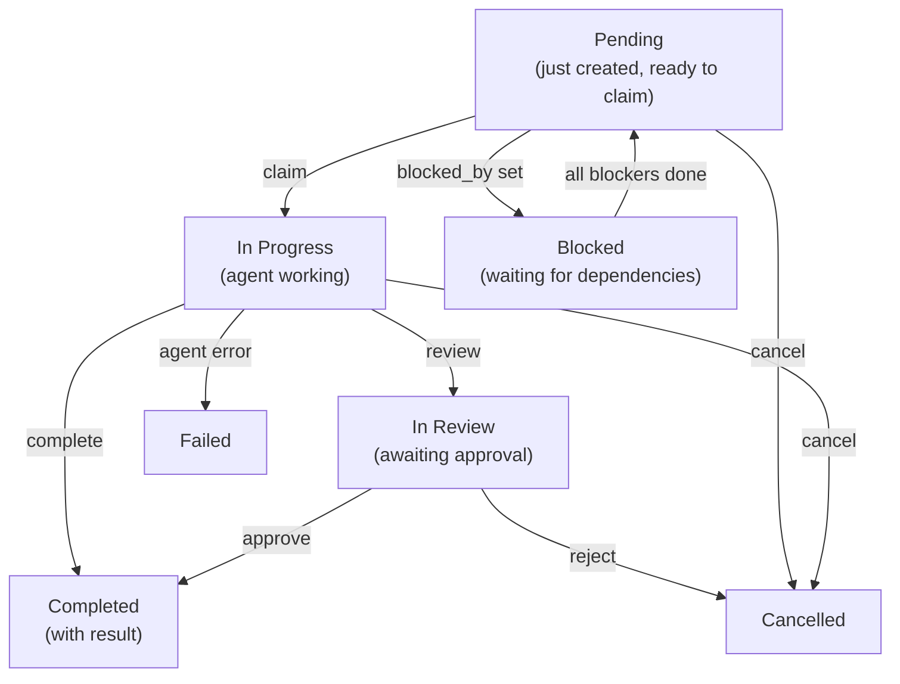
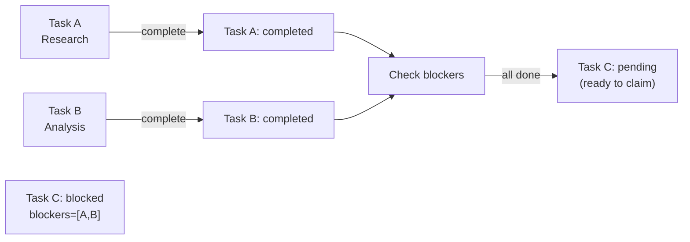

# Task Board

The task board is a shared work tracker accessible to all team members. Tasks can be created with priorities, dependencies, and blocking constraints. Members claim pending tasks, work independently, and mark them complete with results.

## Task Lifecycle



## Core Tool: `team_tasks`

All team members access the task board via the `team_tasks` tool. Available actions:

| Action | Required Params | Description |
|--------|-----------------|-------------|
| `list` | `action` | Show active tasks (pagination: 20 max) |
| `get` | `action`, `task_id` | Get full task detail with comments, events, attachments (result: 8,000 char limit) |
| `create` | `action`, `subject` | Create new task (lead only); optional: `description`, `priority`, `blocked_by`, `require_approval` |
| `claim` | `action`, `task_id` | Atomically claim a pending task |
| `complete` | `action`, `task_id`, `result` | Mark task done with result summary |
| `cancel` | `action`, `task_id` | Cancel task (lead only); optional: `text` (reason) |
| `search` | `action`, `query` | Full-text search over subject + description |

> **Team v2 actions** (require team version 2):

| Action | Required Params | Description |
|--------|-----------------|-------------|
| `review` | `action`, `task_id` | Submit in-progress task for review (owner only) |
| `approve` | `action`, `task_id` | Approve a task in review (lead only) |
| `reject` | `action`, `task_id` | Reject a task in review (lead only); optional: `text` (reason) |
| `comment` | `action`, `task_id`, `text` | Add a comment to a task |
| `progress` | `action`, `task_id`, `percent` | Update progress 0-100 (owner only); optional: `text` (step description) |
| `update` | `action`, `task_id` | Update task subject or description (lead only) |
| `attach` | `action`, `task_id`, `file_id` | Attach a workspace file to a task |
| `await_reply` | `action`, `task_id`, `text` | Set a follow-up reminder (owner only) |
| `clear_followup` | `action`, `task_id` | Clear follow-up reminders (owner or lead) |

## Create a Task

**Lead creates a task** for members to work on:

```json
{
  "action": "create",
  "subject": "Extract key points from research paper",
  "description": "Read the PDF and summarize main findings in bullet points",
  "priority": 10,
  "blocked_by": []
}
```

**Response**:
```
Task created: Extract key points from research paper (id=<uuid>, identifier=TSK-1, status=pending)
```

The `identifier` field (e.g. `TSK-1`) is a short human-readable reference generated from the team name prefix and task number.

**With dependencies** (blocked_by):

```json
{
  "action": "create",
  "subject": "Write summary",
  "priority": 5,
  "blocked_by": ["<first-task-uuid>"]
}
```

This task stays `blocked` until the first task is `completed`. When you complete the blocker, this task automatically transitions to `pending` and becomes claimable.

**With approval required** (require_approval):

```json
{
  "action": "create",
  "subject": "Deploy to production",
  "require_approval": true
}
```

Task starts in `in_review` status and must be approved before it becomes `pending`.

## Claim & Complete a Task

**Member claims a pending task**:

```json
{
  "action": "claim",
  "task_id": "550e8400-e29b-41d4-a716-446655440000"
}
```

**Atomic claiming**: Database ensures only one agent succeeds. If two agents try to claim the same task, one gets `claimed successfully`; the other gets `failed to claim task` (someone else beat you).

**Member completes the task**:

```json
{
  "action": "complete",
  "task_id": "550e8400-e29b-41d4-a716-446655440000",
  "result": "Extracted 12 key findings:\n1. Main hypothesis confirmed\n2. Data suggests..."
}
```

**Auto-claim**: You can skip the claim step. Calling `complete` on a pending task auto-claims it (one API call instead of two).

> **Note**: Delegate agents cannot call `complete` directly — their results are auto-completed when delegation finishes.

## Task Dependencies & Auto-Unblock

When you create a task with `blocked_by: [task_A, task_B]`:
- Task status is set to `blocked`
- Task remains unclaimable
- When **all** blockers are `completed`, task automatically transitions to `pending`
- Members are notified the task is ready



## List & Search

**List active tasks** (default):

```json
{
  "action": "list"
}
```

**Response**:
```json
{
  "tasks": [
    {
      "id": "550e8400-e29b-41d4-a716-446655440000",
      "subject": "Extract key points",
      "description": "Read PDF and summarize...",
      "status": "pending",
      "priority": 10,
      "owner_agent_id": null,
      "created_at": "2025-03-08T10:00:00Z"
    }
  ],
  "count": 1
}
```

**Filter by status**:

```json
{
  "action": "list",
  "status": "all"
}
```

Valid `status` filter values:

| Value | Returns |
|-------|---------|
| `""` (default) | Active tasks: pending, in_progress, blocked |
| `"completed"` | Completed and cancelled tasks |
| `"in_review"` | Tasks awaiting approval |
| `"all"` | All tasks regardless of status |

**Search** for specific tasks:

```json
{
  "action": "search",
  "query": "research paper"
}
```

Results show snippet (500 char max) of full result. Use `action=get` for complete result.

## Priority & Ordering

Tasks are ordered by priority (highest first), then by creation time. Higher priority = gets sorted to top of list:

```json
{
  "action": "create",
  "subject": "Urgent fix needed",
  "priority": 100
}
```

## User Scoping

Access differs by channel:

- **Delegate/system channels**: See all team tasks
- **End users**: See only tasks they triggered (filtered by user ID)

Results are truncated:
- `action=list`: Results not shown (use `get` for full)
- `action=get`: 8,000 characters max
- `action=search`: 500 character snippets

## Get Full Task Details

```json
{
  "action": "get",
  "task_id": "550e8400-e29b-41d4-a716-446655440000"
}
```

**Response** includes:
- Full task metadata (including `identifier`, `task_number`, `progress_percent`)
- Complete result text (truncated at 8,000 chars if needed)
- Owner agent key
- Timestamps
- Comments, audit events, and attachments (if any)

## Cancel a Task

**Lead cancels a task**:

```json
{
  "action": "cancel",
  "task_id": "550e8400-e29b-41d4-a716-446655440000",
  "text": "User request changed, no longer needed"
}
```

Note: the cancel reason is passed via the `text` parameter (not `reason`).

**What happens**:
- Task status → `cancelled`
- If delegation is running for this task, it's stopped immediately
- Any dependent tasks (with `blocked_by` pointing here) become unblocked

## Best Practices

1. **Create tasks first**: Always create a task before delegating work (lead only)
2. **Use priority**: Set priority based on urgency (100 = urgent, 10 = high, 0 = normal)
3. **Add dependencies**: Link related tasks with `blocked_by` to enforce order
4. **Include context**: Write clear descriptions so members know what to do
5. **Check before claiming**: Use `list` to see what's available before claiming
