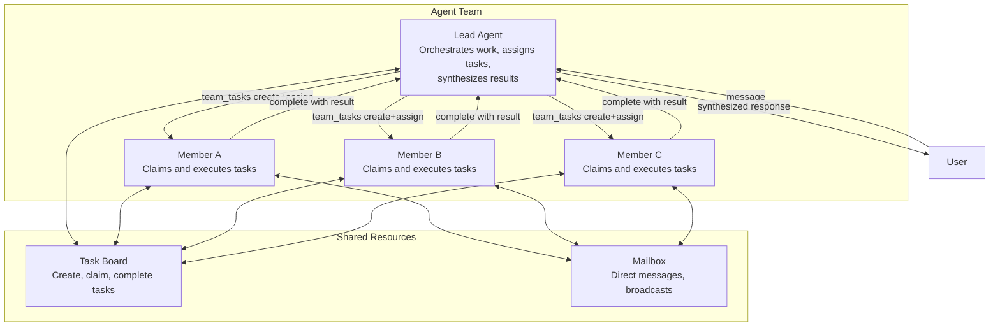

# What Are Agent Teams?

Agent teams enable multiple agents to collaborate on shared tasks. A **lead** agent orchestrates work, while **members** execute tasks independently and report results back.

## The Team Model

Teams consist of:
- **Lead Agent**: Orchestrates work, creates and assigns tasks via `team_tasks`, synthesizes results
- **Member Agents**: Receive dispatched tasks, execute independently, complete with results
- **Reviewer Agents** (optional): Evaluate task results; respond with `APPROVED` or `REJECTED: <feedback>`
- **Shared Task Board**: Track work, dependencies, priority, status
- **Team Mailbox**: Direct messages between members via `team_message`; lead does not have the mailbox tool

## Key Design Principles

**TEAM.md for all**: Every agent in a team — lead and members — receives `TEAM.md` injected into their system prompt. The content is role-aware: leads get full orchestration instructions (`team_tasks` patterns, dependency chains, follow-up reminders); members get execution guidance (`team_tasks` progress reporting).

**Auto-completion**: When a member completes a task, blocked dependents automatically become pending and are dispatched. No manual bookkeeping.

**Parallel work**: Multiple members work simultaneously on independent assigned tasks; each completes independently and the lead is notified per-task.

**Lead cannot use the mailbox**: The `team_message` tool is removed from the lead's tool list by policy. Leads coordinate via `team_tasks`; members use `team_message` to send direct messages to each other.

## Real-World Example

**Scenario**: User asks the lead to analyze a research paper and write a summary.

1. Lead receives request
2. Lead calls `team_tasks(action="create", subject="Extract key points from paper", assignee="researcher")` — system dispatches to researcher
3. Researcher receives task, works independently, calls `team_tasks(action="complete", result="<findings>")` — lead is notified
4. Lead calls `team_tasks(action="create", subject="Write summary", assignee="writer", description="Use researcher findings: <findings>", blocked_by=["<researcher-task-id>"])`
5. Writer's task unblocks automatically when researcher finishes, writer completes with result
6. Lead synthesizes and sends final response to user

## Teams vs Other Delegation Models

| Aspect | Agent Team | Simple Delegation | Agent Link |
|--------|-----------|-------------------|-----------|
| **Coordination** | Lead orchestrates with task board | Parent waits for result | Direct peer-to-peer |
| **Task Tracking** | Shared task board, dependencies, priorities | No tracking | No tracking |
| **Messaging** | Members use mailbox; lead uses team_tasks | Parent-only | Parent-only |
| **Scalability** | Designed for 3-10 members | Simple parent-child | One-to-one links |
| **TEAM.md Context** | All members get role-aware TEAM.md | Not applicable | Not applicable |
| **Use Case** | Parallel research, content review, analysis | Quick delegate & wait | Conversation handoff |

**Use Teams When**:
- 3+ agents need to work together
- Tasks have dependencies or priorities
- Members need to communicate
- Results need parallel batching

**Use Simple Delegation When**:
- One parent delegates to one child
- Need quick synchronous result
- No inter-team communication required

**Use Agent Links When**:
- Conversation needs to transfer between agents
- No task board or orchestration needed

<!-- goclaw-source: 57754a5 | updated: 2026-03-18 -->
