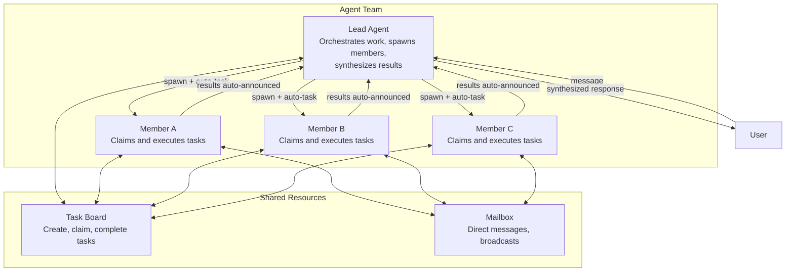

# What Are Agent Teams?

Agent teams enable multiple agents to collaborate on shared tasks. A **lead** agent orchestrates work, while **members** execute tasks independently and report results back.

## The Team Model

Teams consist of:
- **Lead Agent**: Orchestrates work, delegates to members via `spawn`, synthesizes results
- **Member Agents**: Claim tasks from a shared board, execute independently, auto-announce results
- **Reviewer Agents** (optional): Evaluate work when called via `evaluate_loop`; respond with `APPROVED` or `REJECTED: <feedback>`
- **Shared Task Board**: Track work, dependencies, priority, status
- **Team Mailbox**: Direct messages and broadcasts between members (lead cannot send via mailbox)

## Key Design Principles

**TEAM.md for all**: Every agent in a team — lead and members — receives `TEAM.md` injected into their system prompt. The content is role-aware: leads get full orchestration instructions (spawn patterns, dependency chains, follow-up reminders); members get simpler guidance (claim tasks, send progress updates via `team_message`).

**Auto-completion**: When a delegation finishes, its linked task is automatically marked complete. No manual bookkeeping.

**Parallel batching**: When multiple members work simultaneously, results are collected in a single announcement to the lead.

**Lead cannot use the mailbox**: The `team_message` tool is denied for leads. Leads coordinate exclusively via `spawn`; members use `team_message` to send progress updates to each other or to report back.

## Real-World Example

**Scenario**: User asks the lead to analyze a research paper and write a summary.

1. Lead receives request
2. Lead calls `spawn(agent="researcher", task="Extract key points", label="Extract key points")` — system auto-creates a tracking task
3. Researcher works independently, result auto-announced to lead when done
4. Lead calls `spawn(agent="writer", task="Write summary using: <researcher output>", label="Write summary")`
5. Writer finishes, result auto-announced to lead
6. Lead synthesizes and sends final response to user

## Teams vs Other Delegation Models

| Aspect | Agent Team | Simple Delegation | Agent Link |
|--------|-----------|-------------------|-----------|
| **Coordination** | Lead orchestrates with task board | Parent waits for result | Direct peer-to-peer |
| **Task Tracking** | Shared task board, dependencies, priorities | No tracking | No tracking |
| **Messaging** | Members use mailbox; lead uses spawn | Parent-only | Parent-only |
| **Scalability** | Designed for 3-10 members | Simple parent-child | One-to-one links |
| **TEAM.md Context** | All members get role-aware TEAM.md | Not applicable | Not applicable |
| **Use Case** | Parallel research, content review, analysis | Quick delegate & wait | Conversation handoff |

**Use Teams When**:
- 3+ agents need to work together
- Tasks have dependencies or priorities
- Members need to communicate
- Results need parallel batching

**Use Simple Delegation When**:
- One parent delegates to one child
- Need quick synchronous result
- No inter-team communication required

**Use Agent Links When**:
- Conversation needs to transfer between agents
- No task board or orchestration needed
