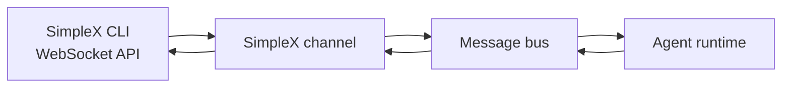
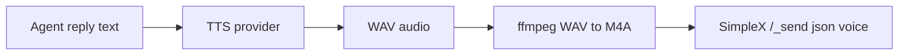

# SimpleX

> Connect GoClaw to a running SimpleX Chat CLI over its WebSocket API for group chat, file handling, STT, and voice-note delivery.

## Overview

The SimpleX channel integrates GoClaw with a local or remote `simplex-chat` CLI instance. GoClaw connects to the CLI over WebSocket, reads incoming events, and sends outbound messages using the same command interface the CLI exposes.

This channel is useful when you want:

- private group chat without Telegram/Discord-style platform lock-in
- local control over transport and file storage
- voice-message workflows with speech-to-text on inbound audio and TTS on outbound replies

GoClaw currently supports:

- group messaging
- text chunking for long replies
- file attachments
- inbound voice/audio transcription via STT proxy
- outbound voice-note delivery when TTS generates audio media

## Architecture



The channel does not talk directly to the SimpleX network. It talks to `simplex-chat`, which remains the actual network client.

## Requirements

- a running `simplex-chat` CLI with WebSocket enabled
- a reachable WebSocket URL such as `ws://127.0.0.1:5226`
- GoClaw configured with `channels.simplex.enabled: true`
- optional: an STT proxy if you want inbound voice messages transcribed

## Minimal Config

```json
{
  "channels": {
    "simplex": {
      "enabled": true,
      "websocket_url": "ws://127.0.0.1:5226",
      "group_policy": "open"
    }
  }
}
```

## Full Config

```json
{
  "channels": {
    "simplex": {
      "enabled": true,
      "websocket_url": "ws://127.0.0.1:5226",
      "allow_from": ["group:simplex:1"],
      "group_policy": "allowlist",
      "allowed_groups": ["1"],
      "text_chunk_limit": 4000,
      "files_folder": "~/.simplex/simplex_v1_files",
      "stt_proxy_url": "http://127.0.0.1:8911",
      "stt_api_key": "optional-token",
      "stt_timeout_seconds": 30,
      "voice_agent_id": "voice-agent"
    }
  }
}
```

## Config Fields

| Field | Type | Default | Description |
|-------|------|---------|-------------|
| `enabled` | boolean | `false` | Enable the SimpleX channel |
| `websocket_url` | string | — | WebSocket endpoint exposed by `simplex-chat` |
| `allow_from` | string[] | — | Optional sender/group allowlist |
| `group_policy` | string | `open` | `open`, `allowlist`, or `disabled` |
| `allowed_groups` | string[] | — | Group IDs allowed when `group_policy` is `allowlist` |
| `text_chunk_limit` | integer | `4000` | Max chars per outbound text chunk |
| `block_reply` | boolean | inherit | Override gateway `block_reply` for this channel |
| `files_folder` | string | `~/.simplex/simplex_v1_files` | Where SimpleX stores received files |
| `stt_proxy_url` | string | — | Speech-to-text proxy for inbound audio/voice |
| `stt_api_key` | string | — | Optional Bearer token for the STT proxy |
| `stt_timeout_seconds` | integer | `30` | STT request timeout |
| `voice_agent_id` | string | — | Route inbound voice/audio to a dedicated agent |

## Group Policy

SimpleX support is currently group-oriented.

| Policy | Behavior |
|--------|----------|
| `open` | Accept messages from all groups |
| `allowlist` | Accept only groups listed in `allowed_groups` |
| `disabled` | Reject all group messages |

## Voice Notes

When an agent reply includes generated audio media marked as voice output, the SimpleX channel sends it as a voice note.

If the audio file is WAV, GoClaw converts it to M4A with `ffmpeg` before sending. This is important because SimpleX voice bubbles expect formats such as M4A or OGG rather than raw WAV.

Outbound flow:



## Speech-to-Text

If `stt_proxy_url` is configured, inbound voice or audio attachments can be transcribed before they reach the agent. This is optional but recommended if you expect voice-first usage.

## Operational Notes

- SimpleX connection state is managed by GoClaw, with reconnect handling in the channel listener.
- Long text replies are split according to `text_chunk_limit`.
- File attachments are sent through the same WebSocket command path used for regular SimpleX CLI actions.
- Voice-note delivery depends on `ffmpeg` being installed when WAV conversion is needed.

## Common Issues

| Issue | Cause | Fix |
|-------|-------|-----|
| No messages delivered | `websocket_url` wrong or CLI not running | Start `simplex-chat` and verify the WS endpoint |
| Groups ignored | `group_policy` is `disabled` or allowlist mismatch | Set `group_policy: "open"` or update `allowed_groups` |
| Voice notes not sent | no audio media produced or `ffmpeg` missing | verify TTS output and install `ffmpeg` |
| Voice note arrives as plain text | no media attachment marked as voice | use GoClaw TTS flow, not text-only tags |
| Inbound audio not transcribed | STT proxy unavailable | verify `stt_proxy_url` and timeout |

## What's Next

- [TTS & Voice](../advanced/tts-voice.md) — text-to-speech and voice note delivery
- [Channels Overview](./overview.md) — channel concepts and policies
- [Config Reference](../reference/config-reference.md) — full channel config options
