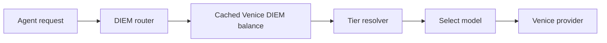

# Venice

> Use Venice as an OpenAI-compatible provider, and optionally wrap it with the DIEM router to steer model choice based on budget consumption.

## Overview

Venice is configured in GoClaw as an OpenAI-compatible provider. In the simplest setup, you add it like any other custom provider and point agents at the provider name.

GoClaw also includes an optional DIEM-aware router that can wrap the Venice provider and transparently switch models as your DIEM spend percentage changes.

## Basic Venice Provider Setup

Add a provider entry using Venice's OpenAI-compatible endpoint:

```json
{
  "providers": {
    "venice": {
      "api_key": "...",
      "api_base": "https://api.venice.ai/api/v1"
    }
  },
  "agents": {
    "defaults": {
      "provider": "venice",
      "model": "claude-sonnet-4-6"
    }
  }
}
```

Use environment variables for the API key in production.

## DIEM Router

When `diem.enabled` is set and `GOCLAW_VENICE_ADMIN_KEY` is available, GoClaw replaces the configured Venice provider in the registry with a router.

That router:

- fetches DIEM balance usage from Venice
- caches the balance for a configurable TTL
- selects a model tier based on current spend percentage
- optionally falls back to another provider when needed
- lowers Venice retry count to avoid wasting budget on repeated `503` retries

The rest of GoClaw still sees the provider as `venice`.

## DIEM Config

```json
{
  "diem": {
    "enabled": true,
    "api_base": "https://api.venice.ai/api/v1",
    "provider_name": "venice",
    "fallback_name": "ollama-cloud",
    "fallback_model": "qwen3.5:397b-cloud",
    "cache_ttl_secs": 600,
    "max_retries": 2,
    "tiers": [
      { "max_percent": 34, "model": "claude-sonnet-4-6" },
      { "max_percent": 64, "model": "grok-4-20-beta" },
      { "max_percent": 89, "model": "gemini-3-flash-preview" },
      { "max_percent": 100, "model": "grok-41-fast" }
    ]
  }
}
```

## Required Environment Variable

```bash
GOCLAW_VENICE_ADMIN_KEY=...
```

This key is used only for DIEM balance queries. Keep it out of `config.json`.

## How Tier Routing Works



If custom tiers are not provided, GoClaw uses built-in defaults.

## Fields

| Field | Type | Default | Description |
|-------|------|---------|-------------|
| `enabled` | boolean | `false` | Enable DIEM-based routing |
| `api_base` | string | `https://api.venice.ai/api/v1` | Venice API base for balance checks |
| `provider_name` | string | `venice` | Registry name of the wrapped Venice provider |
| `fallback_name` | string | `ollama-cloud` | Optional fallback provider |
| `fallback_model` | string | `qwen3.5:397b-cloud` | Model used on the fallback provider |
| `cache_ttl_secs` | integer | `600` | Balance cache TTL |
| `max_retries` | integer | `2` | Max Venice retry attempts |
| `tiers` | array | built-in | Spend-percentage routing table |

Tier rows:

| Field | Type | Description |
|-------|------|-------------|
| `max_percent` | float | Upper inclusive DIEM spend threshold |
| `model` | string | Model to use up to that threshold |

## Publishable Guidance

The DIEM router is useful when you want predictable cost control without manually reconfiguring agents throughout the day. Agents still target the `venice` provider name, but the backing model can shift automatically.

## Common Issues

| Issue | Cause | Fix |
|-------|-------|-----|
| DIEM router not active | `enabled` false or admin key missing | set `diem.enabled: true` and provide `GOCLAW_VENICE_ADMIN_KEY` |
| Venice provider not found | provider name mismatch | align `diem.provider_name` with your configured provider |
| No fallback available | fallback provider not configured | add provider config for `fallback_name` |
| Too many Venice retries | default retry policy too high for budget needs | set `max_retries` explicitly |

## What's Next

- [Providers Overview](./overview.md) — all available providers
- [Cost Tracking](../advanced/cost-tracking.md) — track Venice spending
- [Config Reference](../reference/config-reference.md) — full diem config options
