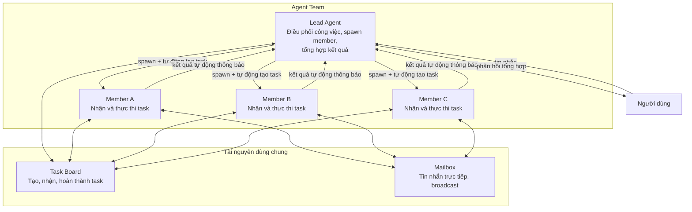

> Bản dịch từ [English version](../../agent-teams/what-are-teams.md)

# Agent Team là gì?

Agent team cho phép nhiều agent cùng cộng tác trên các task chung. Một agent **lead** điều phối công việc, trong khi các **member** thực thi task độc lập và báo cáo kết quả lại.

## Mô hình Team

Một team bao gồm:
- **Lead Agent**: Điều phối công việc, phân công cho member qua `spawn`, tổng hợp kết quả
- **Member Agents**: Nhận task từ board chung, thực thi độc lập, tự động thông báo kết quả
- **Reviewer Agents** (tùy chọn): Đánh giá công việc khi được gọi qua `evaluate_loop`; phản hồi bằng `APPROVED` hoặc `REJECTED: <phản hồi>`
- **Shared Task Board**: Theo dõi công việc, phụ thuộc, mức độ ưu tiên, trạng thái
- **Team Mailbox**: Tin nhắn trực tiếp và broadcast giữa các member (lead không thể gửi qua mailbox)

## Nguyên tắc Thiết kế Cốt lõi

**TEAM.md cho tất cả**: Mọi agent trong team — lead và member — đều nhận `TEAM.md` được inject vào system prompt. Nội dung có nhận thức về vai trò: lead nhận hướng dẫn điều phối đầy đủ (các mẫu spawn, chuỗi phụ thuộc, nhắc nhở follow-up); member nhận hướng dẫn đơn giản hơn (nhận task, gửi cập nhật tiến độ qua `team_message`).

**Tự động hoàn thành**: Khi một delegation kết thúc, task liên kết của nó được tự động đánh dấu hoàn thành. Không cần ghi chép thủ công.

**Xử lý song song**: Khi nhiều member làm việc đồng thời, kết quả được thu thập trong một lần thông báo duy nhất đến lead.

**Lead không thể dùng mailbox**: Tool `team_message` bị từ chối với lead. Lead điều phối hoàn toàn qua `spawn`; member dùng `team_message` để gửi cập nhật tiến độ cho nhau hoặc báo cáo lại.

## Ví dụ Thực tế

**Tình huống**: Người dùng yêu cầu lead phân tích một bài nghiên cứu và viết tóm tắt.

1. Lead nhận yêu cầu
2. Lead gọi `spawn(agent="researcher", task="Trích xuất điểm chính", label="Trích xuất điểm chính")` — hệ thống tự động tạo task theo dõi
3. Researcher làm việc độc lập, kết quả tự động thông báo đến lead khi xong
4. Lead gọi `spawn(agent="writer", task="Viết tóm tắt dựa trên: <kết quả researcher>", label="Viết tóm tắt")`
5. Writer hoàn thành, kết quả tự động thông báo đến lead
6. Lead tổng hợp và gửi phản hồi cuối cùng cho người dùng

## Team so với các Mô hình Delegation Khác

| Khía cạnh | Agent Team | Delegation Đơn giản | Agent Link |
|--------|-----------|-------------------|-----------|
| **Điều phối** | Lead điều phối qua task board | Parent chờ kết quả | Ngang hàng trực tiếp |
| **Theo dõi Task** | Task board chung, phụ thuộc, ưu tiên | Không theo dõi | Không theo dõi |
| **Nhắn tin** | Member dùng mailbox; lead dùng spawn | Chỉ với parent | Chỉ với parent |
| **Khả năng mở rộng** | Thiết kế cho 3–10 member | Parent-child đơn giản | Liên kết 1-1 |
| **Context TEAM.md** | Tất cả member nhận TEAM.md theo vai trò | Không áp dụng | Không áp dụng |
| **Trường hợp dùng** | Nghiên cứu song song, review nội dung, phân tích | Delegate nhanh & chờ | Chuyển giao hội thoại |

**Dùng Team khi**:
- 3+ agent cần làm việc cùng nhau
- Task có phụ thuộc hoặc ưu tiên
- Member cần giao tiếp với nhau
- Kết quả cần xử lý song song

**Dùng Delegation Đơn giản khi**:
- Một parent delegate cho một child
- Cần kết quả đồng bộ nhanh
- Không cần giao tiếp giữa các agent

**Dùng Agent Link khi**:
- Hội thoại cần chuyển giao giữa các agent
- Không cần task board hay điều phối
